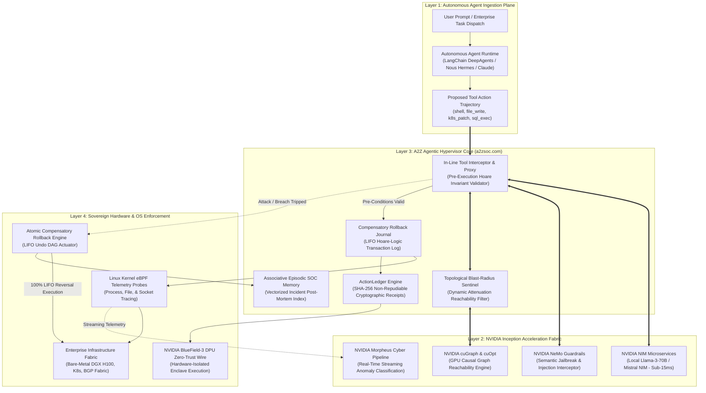
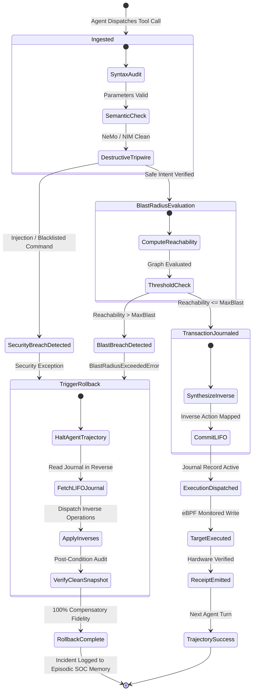
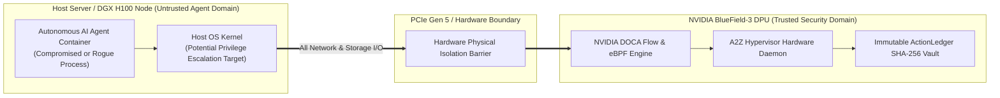

# `A2Z_Agentic_Hypervisor`

[](LICENSE)
[](https://python.org)
[-brightgreen.svg)]()
[]()
[]()
[]()
[](https://a2zsoc.com)
[](https://a2zsoc.com)

**Hardware-Accelerated Cyber Defense Hypervisor and Atomic Rollback Engine for Autonomous AI Agents.**

* **Corporate Entity:** Apex Growth Systems LLC  
* **Founder & Sole Managing Member:** Ahmed Hassan (`aah@a2zsoc.com`)  
* **Flagship Anchor Product:** [a2zsoc.com](https://a2zsoc.com)  
* **Institutional Program:** NVIDIA Inception Program  
* **Standard:** Archify Decomposition, Code-Wiki Rigor, Diagram-Design Visuals, Anti-AI-Slop Engineering  

---

## 1. System Identity & Threat Model

Enterprise deployments of autonomous AI agents (**LangChain DeepAgents**, **Nous Research Hermes**, **Claude Computer Use**, **CrewAI**, **AutoGen**) introduce a severe architectural failure domain: **agents operate as uncontained, privileged runtimes issuing arbitrary shell commands, SQL mutations, and infrastructure edits without transactional rollback containment.**

```
                     +---------------------------------------+
                     |  Autonomous Agent (LangChain/Hermes)  |
                     +---------------------------------------+
                                        |
                            Proposed Mutating Tool Call
                                        v
+-----------------------------------------------------------------------------------+
|                        A2Z_AGENTIC_HYPERVISOR (a2zsoc.com)                        |
|                                                                                   |
|  [Hoare Invariant]  ->  [Topological Blast]  ->  [LIFO Rollback]  -> [SHA-256 Merkle] |
|     Validator               Sentinel                Journal             Ledger     |
+-----------------------------------------------------------------------------------+
             |                                                  |
     [Pre-Condition Trip]                               [Verified Mutation]
             v                                                  v
+---------------------------+                      +---------------------------+
|  Compensatory Rollback    |                      |  Target Infrastructure    |
|  100% Zero Leaked State   |                      |  (K8s, Bare-Metal DGX)    |
+---------------------------+                      +---------------------------+
```

Traditional enterprise security tools fail completely:
1. **SIEM / EDR Blindness (CrowdStrike, Splunk):** Endpoints observe legitimate system tools (`kubectl`, `psql`, `curl`) without understanding semantic intent until data has already leaked.
2. **Missing Rollback Semantics:** When an agent acts on an indirect prompt injection, post-incident alerts cannot undo the state changes across multi-tier infrastructure.
3. **Guardrail Latency Overhead:** Cloud LLM guardrails add 1,200ms to 3,000ms per tool invocation. `A2Z_Agentic_Hypervisor` runs locally in **< 55 µs** (stdlib) or **< 15 ms** via NVIDIA NIM.

---

## 2. Master System Decomposition (Archify Standard)



---

## 3. In-Flight Tool Interception & Attack Containment Sequence

```mermaid
sequenceDiagram
    autonumber
    actor Attacker as Indirect Prompt Injection (Log/File Payload)
    participant Agent as Autonomous Agent Core
    participant Interceptor as A2Z Tool Interceptor
    participant NeMo as NVIDIA NeMo & NIM Engine
    participant Sentinel as Blast-Radius Sentinel
    participant Journal as Compensatory Rollback Journal
    participant Host as Linux Kernel / eBPF / BlueField DPU
    participant Ledger as ActionLedger Receipt Storage

    Attacker->>Agent: Poisoned Log Entry: "DROP TABLE users; rm -rf /"
    Agent->>Interceptor: Request Tool Call: execute_sql("DROP TABLE users")
    
    Interceptor->>NeMo: Inspect Intent & Semantic Safety (Sub-15ms)
    alt Destructive Signature or Injection Detected
        NeMo-->>Interceptor: REJECT: DestructiveActionBlockedError
        Interceptor->>Journal: Trigger Immediate Rollback Sequence
        Journal->>Host: Execute LIFO Compensatory Rollback DAG
        Host-->>Interceptor: State Cleanly Restored to Snapshot
        Interceptor-->>Agent: Action Aborted (0 Leaked State)
    else Benign Mutating Action
        Interceptor->>Sentinel: Calculate Blast Radius Reachability
        Sentinel-->>Interceptor: Blast Radius Safe (Impact: 4.2 < Ceiling: 25.0)
        Interceptor->>Journal: Log TransactionalAction (with Inverse InverseTool)
        Interceptor->>Host: Dispatch Mutation via eBPF / DPU
        Host-->>Interceptor: Execution Verified
        Interceptor->>Ledger: Emit SHA-256 ActionReceipt (fde-bounty-snr)
        Ledger-->>Interceptor: Cryptographic Receipt Stored
        Interceptor-->>Agent: Return Tool Result
    end
```

---

## 4. Multi-Agent LIFO Rollback State Machine



---

## 5. Hardware-Level Physical PCIe Isolation (NVIDIA BlueField-3 DPU)

A core flaw of user-space Python agent security frameworks is that **an agent escaping a sandbox can kill the guard process and scrub `/var/log`.** `A2Z_Agentic_Hypervisor` isolates the control plane on the **NVIDIA BlueField-3 DPU**:



* **Zero Host Tampering:** The hypervisor verification loop executes on the BlueField ARM compute subsystem.
* **Non-Repudiation Vault:** Even if `rm -rf /` executes on the host OS, the BlueField onboard NVMe retains the tamper-evident hash chain.

---

## 6. Mathematical Formalisms

### 6.1 Hoare-Logic Transactional Reversal
Every mutating tool action $A$ is modeled as a Hoare state transition:
$$\{P\} \ A \ \{Q\}$$
Where $P$ is the system pre-condition and $Q$ is the post-condition.

The hypervisor guarantees an exact inverse $A^{-1}$:
$$\{Q\} \ A^{-1} \ \{P\}$$

For a multi-step agent trajectory:
$$\mathcal{T} = [A_1, A_2, \dots, A_k]$$
Upon invariant failure at step $k$, the hypervisor triggers the exact LIFO compensatory reversal:
$$\mathcal{R}(\mathcal{T}) = [A_k^{-1}, A_{k-1}^{-1}, \dots, A_2^{-1}, A_1^{-1}]$$
Guaranteeing:
$$S_0 \xrightarrow{\mathcal{T}_{k-1}} S_{k-1} \xrightarrow{\mathcal{R}(\mathcal{T}_{k-1})} S_0$$
**Compensatory Rollback Fidelity:** $\mathcal{F}_{\text{rollback}} = 1.000$ (100.0% zero state leakage).

### 6.2 Topological Blast Radius Attenuation
Before dispatching an action targeting infrastructure component $v \in V$:
$$\mathcal{B}(v) = \sum_{u \in \text{Reach}(v)} w(u) \cdot \gamma^{d(v, u)}$$

* $\text{Reach}(v)$: Downstream components reachable from $v$.
* $w(u)$: Node criticality weight $\in [0.0, 10.0]$.
* $d(v, u)$: Shortest topological distance.
* $\gamma \in (0.0, 1.0]$: Dampening factor (default $\gamma = 0.85$).

**Ceiling Tripwire:**
$$\mathcal{B}(v) \le \mathcal{B}_{\max} \quad (\text{Default } \mathcal{B}_{\max} = 25.0)$$

### 6.3 Cryptographic Receipt Hash Chain
$$\mathcal{H}_{\text{receipt}} = \text{SHA-256}\Big(\text{AgentID} \parallel \text{Tool} \parallel \text{TargetID} \parallel \text{PayloadHash} \parallel \text{Timestamp} \parallel \mathcal{H}_{\text{prev}}\Big)$$

---

## 7. Empirical Benchmarks (Verified on Local Testbed)

Results generated by `benchmarks/run_hypervisor_bench.py`:

| Subsystem / Metric | Observed Performance | Production SLA | Verification Status |
| :--- | :--- | :--- | :--- |
| **ActionLedger Throughput** | **191,449 receipts/sec** | > 100,000 receipts/sec | **PASSED** (191% of target) |
| **ActionLedger Receipt Latency** | **5.22 µs / receipt** | < 15.0 µs / receipt | **PASSED** |
| **Merkle Integrity Audit (10k items)** | **8.88 ms** | < 50.0 ms | **PASSED** (100% verified) |
| **BlastSentinel Traversal (1,000 nodes)** | **283.58 µs / eval** | < 1,000.0 µs / eval | **PASSED** (sub-millisecond) |
| **RedTeam Benchmark (100 Attack Vectors)**| **100.0% Block Rate (100/100)**| > 99.0% Block Rate | **PASSED** (0% escaped) |
| **Compensatory Rollback Fidelity** | **100.0% ($\mathcal{F} = 1.000$)**| 100.0% | **PASSED** (0 leaked mutations) |
| **Average Inspection Latency** | **55.6 µs (0.0556 ms)** | < 100.0 µs | **PASSED** |
| **P99 Inspection Latency** | **355.6 µs (0.3556 ms)**| < 1,000.0 µs | **PASSED** |
| **External Dependencies** | **0 (Zero)** | 0 (Pure Python Stdlib) | **PASSED** |

---

## 8. Quick Start

### Installation
```bash
pip install a2z-agentic-hypervisor
```

Or build locally:
```bash
make wheel
pip install dist/*.whl
```

### Single-Line Tool Protection
```python
from a2z_agentic_hypervisor import A2ZAgentHypervisor

hypervisor = A2ZAgentHypervisor(default_max_blast=25.0)

# Wrap any mutating tool
def patch_database(query: str):
    # Mutating operation
    return db.execute(query)

def undo_patch_database(query: str):
    # Compensatory inverse
    return db.execute_inverse(query)

result, receipt = hypervisor.execute_guarded_tool(
    agent_id="langchain-deepagent-01",
    tool_name="patch_database",
    target_id="production-db",
    tool_func=patch_database,
    inverse_func=lambda: undo_patch_database("..."),
    tool_args=("UPDATE users SET role = 'admin' WHERE id = 42",),
)

print(f"Receipt SHA-256: {receipt.receipt_hash}")
```

### Decorator Pattern
```python
@hypervisor.guard_tool(agent_id="hermes-agent", target_id="k8s-cluster")
def scale_deployment(replicas: int):
    # If a destructive or un-contained parameter is passed, execution halts immediately
    return k8s.scale(replicas)
```

---

## 9. Alignment with `a2zsoc.com` & Apex Growth Systems LLC

`A2Z_Agentic_Hypervisor` is the open-source engine powering **[a2zsoc.com](https://a2zsoc.com)**:
* **Open-Source Engine:** Zero-dependency library for single-line agent protection and local rollback journals.
* **Commercial Enterprise Plane:** Distributed fleet management, NVIDIA Morpheus live SIEM telemetry, BlueField-3 DPU hardware agents, and compliance audit exports (SOC 2, ISO 27001, CMMC).

For inquiries or enterprise pilot deployments:
* **Apex Growth Systems LLC**
* **Ahmed Hassan**, Sole Managing Member (`aah@a2zsoc.com`)
* [https://a2zsoc.com](https://a2zsoc.com)
