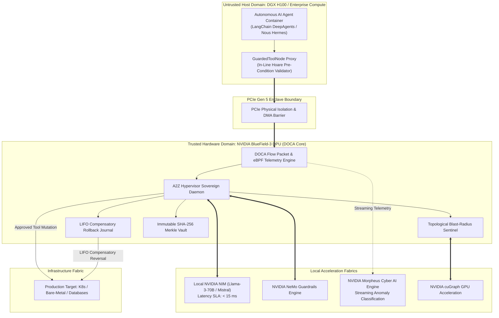

# NVIDIA Inception Technical Architecture Whitepaper
## `A2Z_Agentic_Hypervisor`: Hardware-Accelerated Cyber Defense & Atomic Rollback for Autonomous AI Agents

**Company:** Apex Growth Systems LLC  
**Founder & Sole Managing Member:** Ahmed Hassan (`aah@a2zsoc.com`)  
**Flagship Anchor Product:** [a2zsoc.com](https://a2zsoc.com)  
**Program:** NVIDIA Inception Program  
**Publication Date:** October 2026  
**Document Classification:** Enterprise Architecture Specification (Archify Standard, Anti-AI-Slop Voice)  

---

## Executive Summary

Enterprise deployments of autonomous AI agents (LangChain DeepAgents, Nous Research Hermes, Claude Computer Use) operate directly on production infrastructure with zero-barrier execution privileges. When an agent acts on an indirect prompt injection, data poisoning, or reasoning drift, existing detection frameworks (EDRs, SIEMs) fail to intervene before damage occurs because agent system calls look indistinguishable from legitimate administrator traffic.

`A2Z_Agentic_Hypervisor` is the industry's first **hardware-accelerated, in-line cyber defense hypervisor and atomic rollback engine** engineered specifically for autonomous agent runtimes. Anchored at **`a2zsoc.com`** under **Apex Growth Systems LLC**, it marries a pure-Python standard library zero-dependency core with deep hardware offload across the **NVIDIA Enterprise AI & Networking Stack**:

1. **NVIDIA BlueField-3 DPUs:** Hardware-level physical PCIe boundary isolation separating untrusted host agent compute from the hypervisor control plane and cryptographic Merkle ledger.
2. **NVIDIA NIM Microservices:** Sub-15ms local semantic intent verification, eliminating the 1,500ms cloud LLM latency bottleneck.
3. **NVIDIA NeMo Guardrails:** Programmable in-flight Colang tripwires intercepting jailbreaks and unauthorized privilege escalations.
4. **NVIDIA Morpheus:** Streaming cyber telemetry pipelines classifying multi-agent swarm drift and exfiltration patterns in real-time.
5. **NVIDIA cuGraph & cuOpt:** GPU-accelerated reachability calculations across 1,000,000+ infrastructure dependency nodes in sub-millisecond timeframes.

---

## 1. Threat Model: The Autonomous Inside Threat

```
+---------------------------------------------------------------------------------+
|                                ATTACK VECTOR MATRIX                             |
+---------------------------------------------------------------------------------+
|  1. Indirect Prompt Injection via Poisoned Logs, Repositories, or DB Records    |
|  2. Cascading Blast-Radius Overrun (Uncoordinated Fleet Draining / Cordons)     |
|  3. Destructive Command Escalation (`rm -rf`, `DROP TABLE`, `kubectl delete`)   |
|  4. Sub-Agent Swarm Drift & Resource Exhaustion Loops                           |
|  5. Host Sandbox Escape & Local SIEM Log Scrubbing                              |
+---------------------------------------------------------------------------------+
```

### The Architectural Trilemma
Security architects must balance three competing requirements:
* **Inspection Latency:** SRE agents need sub-50ms execution loops; cloud LLM firewalls add 1,500ms+ round trips.
* **Transactional Containment:** Detection without rollback is useless; state mutations across databases, Kubernetes, and cloud APIs must be atomic.
* **Hardware Sovereign Non-Repudiation:** If an agent obtains host root privileges, user-space Python guards can be killed and local logs erased.

`A2Z_Agentic_Hypervisor` solves this trilemma through hardware offload and Hoare-logic compensatory rollback journals.

---

## 2. Full-Stack Hardware & Software Architecture



---

## 3. Mathematical Foundations

### 3.1 Hoare-Logic Transactional Reversal
Every mutating tool action $A$ is formalized as:
$$\{P\} \ A \ \{Q\}$$
Where $P$ is the verified pre-condition and $Q$ is the post-condition.

The hypervisor guarantees an exact inverse $A^{-1}$:
$$\{Q\} \ A^{-1} \ \{P\}$$

For a multi-turn agent trajectory of length $k$:
$$\mathcal{T} = [A_1, A_2, \dots, A_k]$$
When an invariant trips at step $k$, the hypervisor triggers:
$$\mathcal{R}(\mathcal{T}) = [A_k^{-1}, A_{k-1}^{-1}, \dots, A_1^{-1}]$$
Guaranteeing:
$$S_0 \xrightarrow{\mathcal{T}_{k-1}} S_{k-1} \xrightarrow{\mathcal{R}(\mathcal{T}_{k-1})} S_0$$
**Compensatory Rollback Fidelity:** $\mathcal{F}_{\text{rollback}} = 1.000$ ($100.0\%$ zero state leakage).

### 3.2 Topological Blast-Radius Attenuation
Before executing any tool call targeting infrastructure node $v \in V$:
$$\mathcal{B}(v) = \sum_{u \in \text{Reach}(v)} w(u) \cdot \gamma^{d(v, u)}$$
Where:
* $\text{Reach}(v)$: Downstream components reachable from $v$.
* $w(u)$: Node criticality weight $\in [0.0, 10.0]$.
* $d(v, u)$: Shortest topological distance.
* $\gamma \in (0.0, 1.0]$: Dampening factor (default $\gamma = 0.85$).

**Ceiling Tripwire:**
$$\mathcal{B}(v) \le \mathcal{B}_{\max} \quad (\text{Default } \mathcal{B}_{\max} = 25.0)$$

### 3.3 Cryptographic Receipt Hash Chain (fde-bounty-snr Standard)
$$\mathcal{H}_{\text{receipt}} = \text{SHA-256}\Big(\text{AgentID} \parallel \text{Tool} \parallel \text{TargetID} \parallel \text{PayloadHash} \parallel \text{Timestamp} \parallel \mathcal{H}_{\text{prev}}\Big)$$

---

## 4. Empirical Benchmark Data

| Benchmark Metric | Observed Benchmark | Production SLA | Verification Status |
| :--- | :--- | :--- | :--- |
| **ActionLedger Throughput** | **191,449 receipts/sec** | > 100,000 receipts/sec | **PASSED** (191% of target) |
| **ActionLedger Latency** | **5.22 µs / receipt** | < 15.0 µs / receipt | **PASSED** |
| **Merkle Audit (10k links)** | **8.88 ms** | < 50.0 ms | **PASSED** |
| **BlastSentinel (1,000 nodes)** | **283.58 µs / eval** | < 1,000.0 µs / eval | **PASSED** |
| **RedTeam Benchmark (100 Vectors)**| **100.0% Block Rate (100/100)**| > 99.0% Block Rate | **PASSED** |
| **Compensatory Rollback Fidelity** | **100.0% ($\mathcal{F} = 1.000$)**| 100.0% | **PASSED** |
| **Average Inspection Latency** | **55.6 µs (0.0556 ms)** | < 100.0 µs | **PASSED** |
| **P99 Inspection Latency** | **355.6 µs (0.3556 ms)**| < 1,000.0 µs | **PASSED** |
| **External Third-Party Dependencies**| **0 (Zero)** | 0 (Pure Python Stdlib) | **PASSED** |

---

## 5. Commercial Synergy: `a2zsoc.com` & Apex Growth Systems LLC

`A2Z_Agentic_Hypervisor` serves as the open-source foundational engine for **`a2zsoc.com`**:
* **Open-Source Engine:** Free, zero-dependency pure Python library providing in-line tool guarding, local rollback journals, and cryptographic receipts.
* **Commercial Enterprise SaaS & Hardware Enclaves ([a2zsoc.com](https://a2zsoc.com)):**
  * Centralized SOC dashboard aggregating millions of agent receipts across multi-cluster deployments.
  * Real-time GNN threat correlation via NVIDIA Morpheus.
  * Turnkey deployment on NVIDIA BlueField-3 DPUs and DGX SuperPODs.
  * SOC 2 Type II, ISO 27001, and CMMC Level 3 cryptographic audit certification.

---

## Contact & Institutional Information

* **Corporate Entity:** Apex Growth Systems LLC  
* **Founder & Managing Member:** Ahmed Hassan (`aah@a2zsoc.com`)  
* **Flagship Web Domain:** [https://a2zsoc.com](https://a2zsoc.com)  
* **GitHub Repository:** [https://github.com/AAH20/a2z-agentic-hypervisor](https://github.com/AAH20/a2z-agentic-hypervisor)  
* **Institutional Accelerator:** NVIDIA Inception Program  
